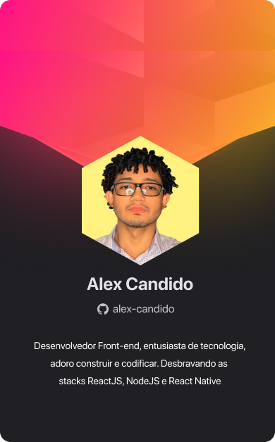

  

## 👋 Hi everyone ! 
## 🚀 About Me

 Acadêmico em Engenharia de Telecomunicações, desenvolvedor Front-End, adoro design, construir e codificar. Formação de Técnico em Redes de Computadores, já atuei nas áreas de Suporte/Manutenção de computadores e em Projetos de Telecomunicações, estou sempre estudando e aprendendo novas tecnologias.

## 🛠 Skills

Possuo conhecimento nas seguintes ferramentas e tecnologias:

- Código: HTML5, CSS3, JavaScript;
- Bibliotecas e Frameworks: ReactJS, ExpressJS;
- Design e Prototipação: Figma;
- Outros: Git/GitHub, VSCode;

 
  
  
  
  
  

## ⚙️ Github Analysis

  <a href="https://github.com/alex-candido">
  
  

