## 👋 Hey guys, I'm Alex Cândido!

- 🛰️ Telecommunications Engineering, IFCE - Fortaleza  
- 🧑🏻‍💻 I'm a Backend developer (Ruby on Rails | Python/Django/Flask | Typescript/Nestjs/Expressjs/Fastify | Reactjs/Nextjs | Vuejs/Nuxtjs)  
- 📫 How to reach me: **alex.candido.dev@gmail.com** or [LinkedIn](https://www.linkedin.com/in/alexcndd/)  
- ⚡️ All of my projects are available here on my GitHub.

---
<table>
  <tr>
    <th><a href="source/plugins/isocalendar/README.md">📅 Isometric commit calendar</a></th>
    <th><a href="source/plugins/languages/README.md">🈷️ Languages activity</a></th>
  </tr>
  <tr>
    <td align="center">
      

        
Full year calendar

        
      

    </td>
    <td align="center">
      

        
Indepth analysis (clone and analyze repositories)

        
      

      

        
Recently used (analyze recent activity events)

        
      

      

        
Default algorithm

        
      

      

        
Default algorithm (with details)

        
      

    </td>
  </tr>
</table>

