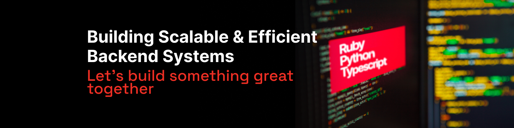

  

---

<table>
  <tr>
    <th>📅 Isometric commit calendar</th>
    <th>🈷️ Languages activity</th>
  </tr>
  <tr>
    <td align="center">
      

        
Full year calendar

        
      

    </td>
    <td align="center">
      

        
Indepth analysis (clone and analyze repositories)

        
      

      

        
Recently used (analyze recent activity events)

        
      

      

        
Default algorithm

        
      

      

        
Default algorithm (with details)

        
      

    </td>
  </tr>
</table>

